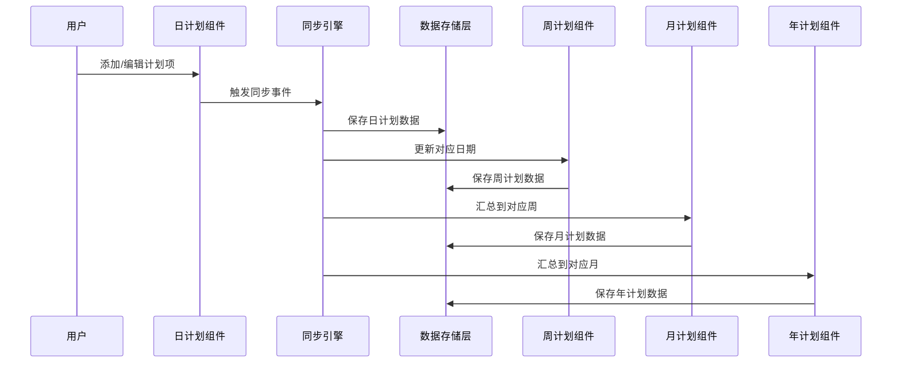
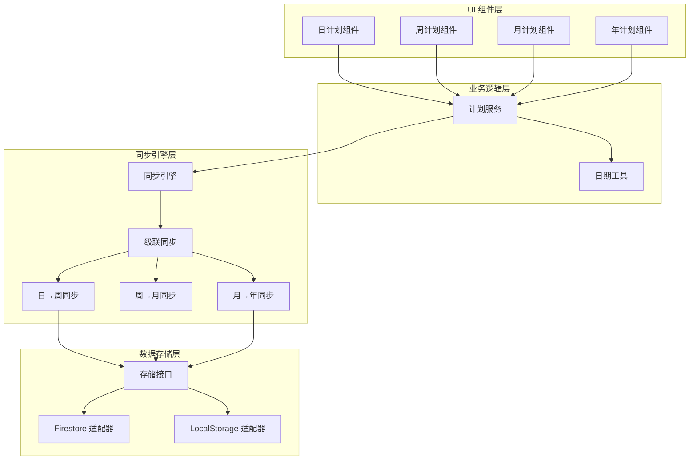

# 设计文档：计划层级联动

## 概述

实现计划的层级联动功能，使日计划、周计划、月计划、年计划之间建立自动同步关系。每个独立的日期作为版本控制的基本单位，按日期存储计划数据。当用户在日计划中添加或编辑计划项时，数据自动同步到周计划对应的日期；周计划数据汇总到月计划对应的周；月计划数据汇总到年计划对应的月。

## 主要算法/工作流



## 核心接口/类型

```typescript
// 计划项基础类型
interface PlanItem {
  id: string;
  text: string;
  completed: boolean;
  createdAt: Date;
  updatedAt: Date;
}

// 日计划数据结构（按日期存储）
interface DailyPlan {
  date: string; // ISO 8601 格式: "2024-01-15"
  mode: 'work' | 'study' | 'life' | 'travel';
  morning: PlanItem[];
  afternoon: PlanItem[];
  evening: PlanItem[];
}

// 周计划数据结构
interface WeeklyPlan {
  weekId: string; // 格式: "2024-W03" (ISO 8601 周编号)
  mode: 'work' | 'study' | 'life' | 'travel';
  startDate: string; // 周一日期
  endDate: string; // 周日日期
  days: {
    [date: string]: DailyPlan; // 键为日期字符串
  };
  weeklyGoals: string[]; // 周目标（用户手动添加）
}

// 月计划数据结构
interface MonthlyPlan {
  monthId: string; // 格式: "2024-01"
  mode: 'work' | 'study' | 'life' | 'travel';
  weeks: {
    [weekId: string]: WeeklySummary; // 键为周ID
  };
  monthlyGoals: string[]; // 月目标（用户手动添加）
}

// 周汇总（用于月计划）
interface WeeklySummary {
  weekId: string;
  startDate: string;
  endDate: string;
  totalItems: number;
  completedItems: number;
  keyHighlights: string[]; // 从周目标提取
}

// 年计划数据结构
interface YearlyPlan {
  year: number; // 2024
  mode: 'work' | 'study' | 'life' | 'travel';
  months: {
    [monthId: string]: MonthlySummary; // 键为月ID
  };
  yearlyGoals: string[]; // 年度目标（用户手动添加）
}

// 月汇总（用于年计划）
interface MonthlySummary {
  monthId: string;
  totalItems: number;
  completedItems: number;
  keyHighlights: string[]; // 从月目标提取
}

// Firestore 文档结构
interface UserPlansDocument {
  userId: string;
  dailyPlans: {
    [date: string]: {
      [mode: string]: DailyPlan;
    };
  };
  weeklyPlans: {
    [weekId: string]: {
      [mode: string]: WeeklyPlan;
    };
  };
  monthlyPlans: {
    [monthId: string]: {
      [mode: string]: MonthlyPlan;
    };
  };
  yearlyPlans: {
    [year: string]: {
      [mode: string]: YearlyPlan;
    };
  };
}

## 关键函数与形式化规范

### 函数 1: syncDailyToWeekly()

```typescript
function syncDailyToWeekly(
  dailyPlan: DailyPlan,
  weeklyPlan: WeeklyPlan
): WeeklyPlan
```

**前置条件：**
- `dailyPlan` 非空且包含有效的日期
- `dailyPlan.date` 在 `weeklyPlan.startDate` 和 `weeklyPlan.endDate` 之间
- `dailyPlan.mode` 与 `weeklyPlan.mode` 相同

**后置条件：**
- 返回更新后的 `WeeklyPlan` 对象
- `weeklyPlan.days[dailyPlan.date]` 包含最新的日计划数据
- 原始 `weeklyPlan` 对象不被修改（不可变更新）

**循环不变式：** N/A（无循环）

### 函数 2: syncWeeklyToMonthly()

```typescript
function syncWeeklyToMonthly(
  weeklyPlan: WeeklyPlan,
  monthlyPlan: MonthlyPlan
): MonthlyPlan
```

**前置条件：**
- `weeklyPlan` 非空且包含有效的 `weekId`
- `weeklyPlan.weekId` 属于 `monthlyPlan.monthId` 对应的月份
- `weeklyPlan.mode` 与 `monthlyPlan.mode` 相同

**后置条件：**
- 返回更新后的 `MonthlyPlan` 对象
- `monthlyPlan.weeks[weeklyPlan.weekId]` 包含周汇总数据
- 汇总数据正确计算：`totalItems` 和 `completedItems` 准确
- 原始 `monthlyPlan` 对象不被修改

**循环不变式：**
- 遍历 `weeklyPlan.days` 时，已处理的天数统计准确

### 函数 3: syncMonthlyToYearly()

```typescript
function syncMonthlyToYearly(
  monthlyPlan: MonthlyPlan,
  yearlyPlan: YearlyPlan
): YearlyPlan
```

**前置条件：**
- `monthlyPlan` 非空且包含有效的 `monthId`
- `monthlyPlan.monthId` 属于 `yearlyPlan.year` 对应的年份
- `monthlyPlan.mode` 与 `yearlyPlan.mode` 相同

**后置条件：**
- 返回更新后的 `YearlyPlan` 对象
- `yearlyPlan.months[monthlyPlan.monthId]` 包含月汇总数据
- 汇总数据正确计算
- 原始 `yearlyPlan` 对象不被修改

**循环不变式：**
- 遍历 `monthlyPlan.weeks` 时，已处理的周数统计准确

### 函数 4: getWeekId()

```typescript
function getWeekId(date: Date): string
```

**前置条件：**
- `date` 是有效的 Date 对象

**后置条件：**
- 返回 ISO 8601 周编号格式字符串（例如："2024-W03"）
- 周一作为一周的开始
- 结果符合 ISO 8601 标准

**循环不变式：** N/A

### 函数 5: getMonthId()

```typescript
function getMonthId(date: Date): string
```

**前置条件：**
- `date` 是有效的 Date 对象

**后置条件：**
- 返回月份 ID 格式字符串（例如："2024-01"）
- 月份始终为两位数（01-12）

**循环不变式：** N/A

## 算法伪代码

### 主同步算法

```typescript
ALGORITHM cascadePlanSync(dailyPlan, mode, userId)
INPUT: dailyPlan (DailyPlan), mode (string), userId (string)
OUTPUT: void (副作用：更新所有层级的计划)

BEGIN
  ASSERT dailyPlan !== null AND dailyPlan.date !== ""
  ASSERT mode IN ['work', 'study', 'life', 'travel']
  
  // 步骤 1: 保存日计划
  date ← dailyPlan.date
  SAVE dailyPlan TO storage AT path: dailyPlans[date][mode]
  
  // 步骤 2: 同步到周计划
  weekId ← getWeekId(parseDate(date))
  weeklyPlan ← LOAD weeklyPlan FROM storage AT path: weeklyPlans[weekId][mode]
  
  IF weeklyPlan = null THEN
    weeklyPlan ← createEmptyWeeklyPlan(weekId, mode)
  END IF
  
  updatedWeeklyPlan ← syncDailyToWeekly(dailyPlan, weeklyPlan)
  SAVE updatedWeeklyPlan TO storage AT path: weeklyPlans[weekId][mode]
  
  // 步骤 3: 同步到月计划
  monthId ← getMonthId(parseDate(date))
  monthlyPlan ← LOAD monthlyPlan FROM storage AT path: monthlyPlans[monthId][mode]
  
  IF monthlyPlan = null THEN
    monthlyPlan ← createEmptyMonthlyPlan(monthId, mode)
  END IF
  
  updatedMonthlyPlan ← syncWeeklyToMonthly(updatedWeeklyPlan, monthlyPlan)
  SAVE updatedMonthlyPlan TO storage AT path: monthlyPlans[monthId][mode]
  
  // 步骤 4: 同步到年计划
  year ← extractYear(date)
  yearlyPlan ← LOAD yearlyPlan FROM storage AT path: yearlyPlans[year][mode]
  
  IF yearlyPlan = null THEN
    yearlyPlan ← createEmptyYearlyPlan(year, mode)
  END IF
  
  updatedYearlyPlan ← syncMonthlyToYearly(updatedMonthlyPlan, yearlyPlan)
  SAVE updatedYearlyPlan TO storage AT path: yearlyPlans[year][mode]
  
  ASSERT updatedYearlyPlan !== null
END
```

**前置条件：**
- dailyPlan 已验证且格式正确
- userId 对应的用户存在
- 存储层可访问

**后置条件：**
- 所有层级的计划已更新
- 数据一致性得到保证
- 无数据丢失

**循环不变式：** N/A（顺序执行，无循环）

### 日计划到周计划同步算法

```typescript
ALGORITHM syncDailyToWeekly(dailyPlan, weeklyPlan)
INPUT: dailyPlan (DailyPlan), weeklyPlan (WeeklyPlan)
OUTPUT: updatedWeeklyPlan (WeeklyPlan)

BEGIN
  ASSERT dailyPlan.mode = weeklyPlan.mode
  ASSERT dailyPlan.date >= weeklyPlan.startDate AND dailyPlan.date <= weeklyPlan.endDate
  
  // 创建新的周计划对象（不可变更新）
  updatedWeeklyPlan ← CLONE weeklyPlan
  
  // 更新对应日期的数据
  updatedWeeklyPlan.days[dailyPlan.date] ← dailyPlan
  
  ASSERT updatedWeeklyPlan.days[dailyPlan.date] !== null
  
  RETURN updatedWeeklyPlan
END
```

**前置条件：**
- dailyPlan 和 weeklyPlan 的 mode 相同
- dailyPlan.date 在 weeklyPlan 的日期范围内

**后置条件：**
- 返回新的 WeeklyPlan 对象
- 原始 weeklyPlan 未被修改
- 指定日期的数据已更新

### 周计划到月计划同步算法

```typescript
ALGORITHM syncWeeklyToMonthly(weeklyPlan, monthlyPlan)
INPUT: weeklyPlan (WeeklyPlan), monthlyPlan (MonthlyPlan)
OUTPUT: updatedMonthlyPlan (MonthlyPlan)

BEGIN
  ASSERT weeklyPlan.mode = monthlyPlan.mode
  
  // 计算周汇总数据
  totalItems ← 0
  completedItems ← 0
  
  FOR each date IN weeklyPlan.days DO
    ASSERT totalItems >= 0 AND completedItems >= 0
    
    dailyPlan ← weeklyPlan.days[date]
    totalItems ← totalItems + COUNT(dailyPlan.morning) + COUNT(dailyPlan.afternoon) + COUNT(dailyPlan.evening)
    
    FOR each item IN [dailyPlan.morning, dailyPlan.afternoon, dailyPlan.evening] DO
      IF item.completed = true THEN
        completedItems ← completedItems + 1
      END IF
    END FOR
  END FOR
  
  // 创建周汇总
  weeklySummary ← {
    weekId: weeklyPlan.weekId,
    startDate: weeklyPlan.startDate,
    endDate: weeklyPlan.endDate,
    totalItems: totalItems,
    completedItems: completedItems,
    keyHighlights: weeklyPlan.weeklyGoals
  }
  
  // 创建新的月计划对象
  updatedMonthlyPlan ← CLONE monthlyPlan
  updatedMonthlyPlan.weeks[weeklyPlan.weekId] ← weeklySummary
  
  ASSERT updatedMonthlyPlan.weeks[weeklyPlan.weekId] !== null
  
  RETURN updatedMonthlyPlan
END
```

**前置条件：**
- weeklyPlan 和 monthlyPlan 的 mode 相同
- weeklyPlan.weekId 属于 monthlyPlan 对应的月份

**后置条件：**
- 返回新的 MonthlyPlan 对象
- 周汇总数据准确计算
- 原始 monthlyPlan 未被修改

**循环不变式：**
- 在遍历 weeklyPlan.days 时，totalItems 和 completedItems 始终非负
- 已处理的天数统计准确

### 月计划到年计划同步算法

```typescript
ALGORITHM syncMonthlyToYearly(monthlyPlan, yearlyPlan)
INPUT: monthlyPlan (MonthlyPlan), yearlyPlan (YearlyPlan)
OUTPUT: updatedYearlyPlan (YearlyPlan)

BEGIN
  ASSERT monthlyPlan.mode = yearlyPlan.mode
  
  // 计算月汇总数据
  totalItems ← 0
  completedItems ← 0
  
  FOR each weekId IN monthlyPlan.weeks DO
    ASSERT totalItems >= 0 AND completedItems >= 0
    
    weeklySummary ← monthlyPlan.weeks[weekId]
    totalItems ← totalItems + weeklySummary.totalItems
    completedItems ← completedItems + weeklySummary.completedItems
  END FOR
  
  // 创建月汇总
  monthlySummary ← {
    monthId: monthlyPlan.monthId,
    totalItems: totalItems,
    completedItems: completedItems,
    keyHighlights: monthlyPlan.monthlyGoals
  }
  
  // 创建新的年计划对象
  updatedYearlyPlan ← CLONE yearlyPlan
  updatedYearlyPlan.months[monthlyPlan.monthId] ← monthlySummary
  
  ASSERT updatedYearlyPlan.months[monthlyPlan.monthId] !== null
  
  RETURN updatedYearlyPlan
END
```

**前置条件：**
- monthlyPlan 和 yearlyPlan 的 mode 相同
- monthlyPlan.monthId 属于 yearlyPlan 对应的年份

**后置条件：**
- 返回新的 YearlyPlan 对象
- 月汇总数据准确计算
- 原始 yearlyPlan 未被修改

**循环不变式：**
- 在遍历 monthlyPlan.weeks 时，totalItems 和 completedItems 始终非负
- 已处理的周数统计准确

## 示例用法

```typescript
// 示例 1: 用户添加日计划项
const dailyPlan: DailyPlan = {
  date: "2024-01-15",
  mode: "work",
  morning: [
    { id: "1", text: "完成项目报告", completed: false, createdAt: new Date(), updatedAt: new Date() }
  ],
  afternoon: [
    { id: "2", text: "团队会议", completed: false, createdAt: new Date(), updatedAt: new Date() }
  ],
  evening: []
};

// 触发级联同步
await cascadePlanSync(dailyPlan, "work", "user123");

// 示例 2: 查询周计划（自动包含日计划数据）
const weekId = getWeekId(new Date("2024-01-15"));
const weeklyPlan = await loadWeeklyPlan(weekId, "work", "user123");
console.log(weeklyPlan.days["2024-01-15"]); // 包含上面添加的日计划

// 示例 3: 查询月计划（自动包含周汇总）
const monthId = getMonthId(new Date("2024-01-15"));
const monthlyPlan = await loadMonthlyPlan(monthId, "work", "user123");
console.log(monthlyPlan.weeks[weekId]); // 包含周汇总数据

// 示例 4: 数据迁移
const oldData = loadOldPlanData("user123");
const migratedData = await migratePlanData(oldData);
await saveMigratedData(migratedData, "user123");
```

## 正确性属性

*属性是一个特征或行为，应该在系统的所有有效执行中保持为真——本质上是关于系统应该做什么的形式化陈述。属性是人类可读规范和机器可验证正确性保证之间的桥梁。*

### 属性 1：级联同步完整性

*对于任意*日计划和日期，当保存该日计划时，对应的周计划、月计划和年计划都应该包含该日计划的数据或汇总信息。

**验证需求：2.1, 3.1, 4.1, 5.1, 5.5**

### 属性 2：同步数据完整性

*对于任意*日计划，同步到周计划后，周计划中对应日期的数据应该与原始日计划完全相同（包含所有计划项的文本、完成状态、时间戳等）。

**验证需求：2.2, 5.6**

### 属性 3：同步操作不可变性

*对于任意*日计划、周计划或月计划，执行同步操作后，原始的输入对象应该保持不变（不可变更新）。

**验证需求：2.5, 3.7, 4.7**

### 属性 4：同步幂等性

*对于任意*日计划，多次执行相同的级联同步操作应该产生相同的结果。

**验证需求：2.6**

### 属性 5：周汇总计算准确性

*对于任意*周计划，计算的周汇总中的总计划项数量(totalItems)应该等于该周所有日计划中所有时间段的计划项总数，已完成数量(completedItems)应该等于所有标记为完成的计划项总数。

**验证需求：3.2, 3.3**

### 属性 6：月汇总计算准确性

*对于任意*月计划，计算的月汇总中的总计划项数量(totalItems)应该等于该月所有周汇总的totalItems之和，已完成数量(completedItems)应该等于所有周汇总的completedItems之和。

**验证需求：4.2, 4.3**

### 属性 7：汇总数据不变式

*对于任意*周汇总或月汇总，已完成数量(completedItems)必须小于或等于总数量(totalItems)，且两者都必须是非负数。

**验证需求：3.4, 4.4, 10.8, 10.9**

### 属性 8：目标映射完整性

*对于任意*周计划，其周目标(weeklyGoals)应该作为关键亮点(keyHighlights)完整地包含在月计划的周汇总中；同样，月计划的月目标(monthlyGoals)应该完整地包含在年计划的月汇总中。

**验证需求：3.5, 4.5**

### 属性 9：日期格式一致性

*对于任意*日期，系统生成的日期字符串应该符合ISO 8601格式(YYYY-MM-DD)，周ID应该符合ISO 8601周编号格式(YYYY-Www)，月ID应该符合YYYY-MM格式。

**验证需求：6.1, 6.2, 6.3, 10.1, 10.5, 10.6**

### 属性 10：周边界正确性

*对于任意*周ID，计算出的周开始日期(startDate)应该是周一，周结束日期(endDate)应该是周日。

**验证需求：6.4, 6.5**

### 属性 11：日期范围验证

*对于任意*日计划和周计划的同步操作，如果日计划的日期不在周计划的日期范围内(startDate到endDate)，系统应该抛出日期范围错误。

**验证需求：2.3, 11.1**

### 属性 12：模式匹配验证

*对于任意*两个计划的同步操作，如果源计划和目标计划的模式(mode)不相同，系统应该抛出模式不匹配错误。

**验证需求：2.4, 7.3, 11.2**

### 属性 13：计划项ID唯一性

*对于任意*日计划，其中所有计划项的ID应该是唯一的，不存在重复。

**验证需求：1.6, 10.4**

### 属性 14：计划项数据结构完整性

*对于任意*新创建的计划项，应该包含id、text、completed、createdAt、updatedAt五个字段，且text长度在1到500字符之间。

**验证需求：1.7, 10.3**

### 属性 15：日计划时间段完整性

*对于任意*日计划，应该包含morning、afternoon、evening三个时间段字段，且每个字段都是数组类型。

**验证需求：1.5**

### 属性 16：计划项更新时间戳

*对于任意*计划项，当其内容或完成状态被修改时，updatedAt时间戳应该更新为当前时间且晚于原来的时间。

**验证需求：1.2, 1.3**

### 属性 17：计划模式数据隔离

*对于任意*两种不同的计划模式(work, study, life, travel)，在一个模式下保存的计划数据不应该出现在另一个模式的计划数据中。

**验证需求：7.2, 7.5**

### 属性 18：输入验证拒绝无效数据

*对于任意*无效的输入数据（如无效的日期格式、不在枚举范围内的模式、超长的文本、无效的年份等），系统应该拒绝该输入并抛出数据验证错误。

**验证需求：6.7, 10.2, 10.7, 10.10**

### 属性 19：HTML特殊字符转义

*对于任意*包含HTML特殊字符（如<, >, &, ", '）的计划项文本，系统应该在存储或显示前将这些字符转义，以防止XSS攻击。

**验证需求：13.5**

### 属性 20：数据迁移保持完整性

*对于任意*旧格式的计划数据，迁移到新格式后，计划项的总数量应该保持不变，且每个迁移后的计划项都应该有唯一的ID和有效的时间戳。

**验证需求：14.3, 14.4, 14.6**

## 架构

系统采用分层架构，从下到上依次为：数据存储层、同步引擎层、业务逻辑层、UI 组件层。



## 组件和接口

### 组件 1: 同步引擎 (SyncEngine)

**目的：** 协调所有层级之间的数据同步

**接口：**
```typescript
interface ISyncEngine {
  cascadeSync(dailyPlan: DailyPlan, mode: PlanMode, userId: string): Promise<void>;
  syncDailyToWeekly(dailyPlan: DailyPlan, weeklyPlan: WeeklyPlan): WeeklyPlan;
  syncWeeklyToMonthly(weeklyPlan: WeeklyPlan, monthlyPlan: MonthlyPlan): MonthlyPlan;
  syncMonthlyToYearly(monthlyPlan: MonthlyPlan, yearlyPlan: YearlyPlan): YearlyPlan;
}
```

**职责：**
- 执行级联同步逻辑
- 确保数据一致性
- 处理同步错误和重试

### 组件 2: 计划服务 (PlanService)

**目的：** 提供计划数据的 CRUD 操作

**接口：**
```typescript
interface IPlanService {
  // 日计划操作
  saveDailyPlan(date: string, mode: PlanMode, plan: DailyPlan): Promise<void>;
  loadDailyPlan(date: string, mode: PlanMode, userId: string): Promise<DailyPlan | null>;
  
  // 周计划操作
  loadWeeklyPlan(weekId: string, mode: PlanMode, userId: string): Promise<WeeklyPlan | null>;
  updateWeeklyGoals(weekId: string, mode: PlanMode, goals: string[]): Promise<void>;
  
  // 月计划操作
  loadMonthlyPlan(monthId: string, mode: PlanMode, userId: string): Promise<MonthlyPlan | null>;
  updateMonthlyGoals(monthId: string, mode: PlanMode, goals: string[]): Promise<void>;
  
  // 年计划操作
  loadYearlyPlan(year: number, mode: PlanMode, userId: string): Promise<YearlyPlan | null>;
  updateYearlyGoals(year: number, mode: PlanMode, goals: string[]): Promise<void>;
}
```

**职责：**
- 封装数据访问逻辑
- 调用同步引擎
- 处理用户认证状态

### 组件 3: 存储接口 (StorageInterface)

**目的：** 抽象数据存储实现，支持 Firestore 和 LocalStorage

**接口：**
```typescript
interface IStorageAdapter {
  get<T>(path: string): Promise<T | null>;
  set<T>(path: string, data: T): Promise<void>;
  update<T>(path: string, data: Partial<T>): Promise<void>;
  delete(path: string): Promise<void>;
}
```

**职责：**
- 提供统一的存储接口
- 根据用户登录状态选择存储方式
- 处理数据序列化和反序列化

### 组件 4: 日期工具 (DateUtils)

**目的：** 提供日期相关的工具函数

**接口：**
```typescript
interface IDateUtils {
  getWeekId(date: Date): string;
  getMonthId(date: Date): string;
  getWeekStartDate(weekId: string): Date;
  getWeekEndDate(weekId: string): Date;
  parseDate(dateString: string): Date;
  formatDate(date: Date): string;
}
```

**职责：**
- 日期格式转换
- 周/月 ID 计算
- ISO 8601 标准支持

## 数据模型

### 模型 1: DailyPlan

```typescript
interface DailyPlan {
  date: string; // ISO 8601: "2024-01-15"
  mode: 'work' | 'study' | 'life' | 'travel';
  morning: PlanItem[];
  afternoon: PlanItem[];
  evening: PlanItem[];
}

interface PlanItem {
  id: string;
  text: string;
  completed: boolean;
  createdAt: Date;
  updatedAt: Date;
}
```

**验证规则：**
- `date` 必须是有效的 ISO 8601 日期格式
- `mode` 必须是四个枚举值之一
- `morning`, `afternoon`, `evening` 必须是数组
- 每个 `PlanItem.id` 必须唯一
- `PlanItem.text` 不能为空字符串

### 模型 2: WeeklyPlan

```typescript
interface WeeklyPlan {
  weekId: string; // "2024-W03"
  mode: 'work' | 'study' | 'life' | 'travel';
  startDate: string;
  endDate: string;
  days: {
    [date: string]: DailyPlan;
  };
  weeklyGoals: string[];
}
```

**验证规则：**
- `weekId` 必须符合 ISO 8601 周编号格式
- `startDate` 必须是周一
- `endDate` 必须是周日
- `days` 中的键必须在 `startDate` 和 `endDate` 之间
- `weeklyGoals` 可以为空数组

### 模型 3: MonthlyPlan

```typescript
interface MonthlyPlan {
  monthId: string; // "2024-01"
  mode: 'work' | 'study' | 'life' | 'travel';
  weeks: {
    [weekId: string]: WeeklySummary;
  };
  monthlyGoals: string[];
}

interface WeeklySummary {
  weekId: string;
  startDate: string;
  endDate: string;
  totalItems: number;
  completedItems: number;
  keyHighlights: string[];
}
```

**验证规则：**
- `monthId` 格式为 "YYYY-MM"
- `totalItems` 和 `completedItems` 必须非负
- `completedItems` 不能大于 `totalItems`
- `weeks` 中的周必须属于该月

### 模型 4: YearlyPlan

```typescript
interface YearlyPlan {
  year: number;
  mode: 'work' | 'study' | 'life' | 'travel';
  months: {
    [monthId: string]: MonthlySummary;
  };
  yearlyGoals: string[];
}

interface MonthlySummary {
  monthId: string;
  totalItems: number;
  completedItems: number;
  keyHighlights: string[];
}
```

**验证规则：**
- `year` 必须是有效的四位数年份
- `totalItems` 和 `completedItems` 必须非负
- `completedItems` 不能大于 `totalItems`
- `months` 中的月份必须属于该年（01-12）

## 错误处理

### 错误场景 1: 日期不在周范围内

**条件：** 尝试将日计划同步到不包含该日期的周计划
**响应：** 抛出 `DateOutOfRangeError` 异常
**恢复：** 自动创建或加载正确的周计划，然后重试同步

### 错误场景 2: 模式不匹配

**条件：** 尝试同步不同模式的计划（例如：work 日计划同步到 study 周计划）
**响应：** 抛出 `ModeMismatchError` 异常
**恢复：** 记录错误日志，不执行同步操作

### 错误场景 3: 存储失败

**条件：** Firestore 或 LocalStorage 写入失败
**响应：** 抛出 `StorageError` 异常
**恢复：** 使用指数退避策略重试最多 3 次，失败后通知用户

### 错误场景 4: 数据格式错误

**条件：** 从存储加载的数据不符合预期格式
**响应：** 抛出 `DataValidationError` 异常
**恢复：** 尝试数据修复，如果无法修复则使用默认空数据

### 错误场景 5: 网络错误（Firestore）

**条件：** 用户已登录但网络不可用
**响应：** 抛出 `NetworkError` 异常
**恢复：** 降级到 LocalStorage，待网络恢复后同步

## 测试策略

### 单元测试方法

针对每个核心函数编写单元测试，确保：
- 前置条件验证正确
- 后置条件满足
- 边界情况处理正确
- 错误情况抛出预期异常

**关键测试用例：**
- `syncDailyToWeekly`: 测试日期在周范围内、边界日期、模式匹配
- `syncWeeklyToMonthly`: 测试汇总计算准确性、空周处理
- `syncMonthlyToYearly`: 测试跨年边界、汇总准确性
- `getWeekId`: 测试 ISO 8601 周编号计算、跨年周处理
- `cascadeSync`: 测试完整的级联同步流程

### 属性测试方法

**属性测试库：** fast-check (TypeScript)

**属性 1: 数据一致性**
```typescript
// 任意日计划同步后，周计划必须包含该日期
fc.assert(
  fc.property(
    fc.record({
      date: fc.date(),
      mode: fc.constantFrom('work', 'study', 'life', 'travel'),
      morning: fc.array(planItemArbitrary),
      afternoon: fc.array(planItemArbitrary),
      evening: fc.array(planItemArbitrary)
    }),
    async (dailyPlan) => {
      await cascadeSync(dailyPlan, dailyPlan.mode, 'testUser');
      const weekId = getWeekId(dailyPlan.date);
      const weeklyPlan = await loadWeeklyPlan(weekId, dailyPlan.mode, 'testUser');
      return weeklyPlan.days[formatDate(dailyPlan.date)] !== undefined;
    }
  )
);
```

**属性 2: 幂等性**
```typescript
// 相同的日计划多次同步产生相同的结果
fc.assert(
  fc.property(
    dailyPlanArbitrary,
    async (dailyPlan) => {
      await cascadeSync(dailyPlan, dailyPlan.mode, 'testUser');
      const result1 = await loadAllPlans(dailyPlan.date, dailyPlan.mode, 'testUser');
      
      await cascadeSync(dailyPlan, dailyPlan.mode, 'testUser');
      const result2 = await loadAllPlans(dailyPlan.date, dailyPlan.mode, 'testUser');
      
      return deepEqual(result1, result2);
    }
  )
);
```

**属性 3: 汇总准确性**
```typescript
// 周汇总的总数必须等于所有日计划项的总和
fc.assert(
  fc.property(
    weeklyPlanArbitrary,
    (weeklyPlan) => {
      const manualTotal = Object.values(weeklyPlan.days).reduce((sum, day) => {
        return sum + day.morning.length + day.afternoon.length + day.evening.length;
      }, 0);
      
      const summary = calculateWeeklySummary(weeklyPlan);
      return summary.totalItems === manualTotal;
    }
  )
);
```

### 集成测试方法

测试完整的用户工作流：
1. 用户添加日计划 → 验证周/月/年计划自动更新
2. 用户修改日计划 → 验证所有层级同步更新
3. 用户删除日计划 → 验证汇总数据重新计算
4. 用户在不同设备登录 → 验证数据同步一致性
5. 用户从未登录切换到已登录 → 验证数据迁移

## 性能考虑

### 优化策略 1: 批量同步

当用户快速添加多个日计划项时，使用防抖（debounce）策略，延迟 500ms 后批量执行同步，减少 Firestore 写入次数。

### 优化策略 2: 增量更新

仅更新变化的数据，而不是每次都重写整个文档。使用 Firestore 的 `merge: true` 选项。

### 优化策略 3: 缓存策略

在内存中缓存当前周/月/年的计划数据，避免重复从 Firestore 读取。缓存失效策略：
- 时间失效：5 分钟
- 手动失效：用户切换日期或模式时

### 优化策略 4: 懒加载

周/月/年计划组件仅在用户切换到对应视图时才加载数据，而不是一次性加载所有数据。

### 性能指标

- 日计划保存响应时间：< 200ms
- 级联同步完成时间：< 500ms
- 周计划加载时间：< 300ms
- 月计划加载时间：< 400ms
- 年计划加载时间：< 500ms

## 安全考虑

### 安全策略 1: 数据隔离

每个用户的计划数据完全隔离，使用 `userId` 作为 Firestore 文档 ID，确保用户只能访问自己的数据。

**Firestore 安全规则：**
```javascript
rules_version = '2';
service cloud.firestore {
  match /databases/{database}/documents {
    match /plans/{userId} {
      allow read, write: if request.auth != null && request.auth.uid == userId;
    }
  }
}
```

### 安全策略 2: 输入验证

所有用户输入必须经过验证和清理：
- 计划项文本长度限制：1-500 字符
- 防止 XSS 攻击：转义 HTML 特殊字符
- 防止注入攻击：验证日期格式

### 安全策略 3: 敏感数据保护

计划内容可能包含敏感信息，采取以下措施：
- 传输加密：使用 HTTPS
- 存储加密：Firestore 默认加密
- 日志脱敏：不在日志中记录计划内容

### 安全策略 4: 访问控制

- 未登录用户：只能访问 LocalStorage 数据
- 已登录用户：只能访问自己的 Firestore 数据
- 管理员：无特殊权限（无需管理员功能）

## 数据迁移策略

### 迁移步骤

**步骤 1: 分析旧数据结构**

旧数据结构（当前实现）：
```typescript
// Firestore: plans/{userId}
{
  work_Daily_goals: { morning: string[], afternoon: string[], evening: string[] },
  work_Weekly_goals: { monday: {...}, tuesday: {...}, ... },
  work_Monthly_goals: { week1: string[], week2: string[], ... },
  work_Yearly_goals: string[],
  // study, life, travel 类似
}
```

**步骤 2: 创建迁移函数**

```typescript
async function migratePlanData(userId: string): Promise<void> {
  // 1. 加载旧数据
  const oldData = await loadOldPlanData(userId);
  
  // 2. 转换为新数据结构
  const newData: UserPlansDocument = {
    userId,
    dailyPlans: {},
    weeklyPlans: {},
    monthlyPlans: {},
    yearlyPlans: {}
  };
  
  // 3. 迁移日计划（假设迁移当天的数据）
  const today = formatDate(new Date());
  for (const mode of ['work', 'study', 'life', 'travel']) {
    const oldDailyKey = `${mode}_Daily_goals`;
    if (oldData[oldDailyKey]) {
      newData.dailyPlans[today] = {
        [mode]: {
          date: today,
          mode: mode as PlanMode,
          morning: oldData[oldDailyKey].morning.map(text => createPlanItem(text)),
          afternoon: oldData[oldDailyKey].afternoon.map(text => createPlanItem(text)),
          evening: oldData[oldDailyKey].evening.map(text => createPlanItem(text))
        }
      };
    }
  }
  
  // 4. 保存新数据
  await saveNewPlanData(userId, newData);
  
  // 5. 备份旧数据（可选）
  await backupOldData(userId, oldData);
}

function createPlanItem(text: string): PlanItem {
  return {
    id: crypto.randomUUID(),
    text,
    completed: false,
    createdAt: new Date(),
    updatedAt: new Date()
  };
}
```

**步骤 3: 执行迁移**

迁移时机选择：
- **选项 A（推荐）：** 用户首次使用新版本时自动迁移
- **选项 B：** 后台批量迁移所有用户数据
- **选项 C：** 提供手动迁移按钮，由用户触发

**步骤 4: 验证迁移结果**

```typescript
async function validateMigration(userId: string): Promise<boolean> {
  const oldData = await loadOldPlanData(userId);
  const newData = await loadNewPlanData(userId);
  
  // 验证数据完整性
  for (const mode of ['work', 'study', 'life', 'travel']) {
    const oldDailyKey = `${mode}_Daily_goals`;
    const today = formatDate(new Date());
    
    if (oldData[oldDailyKey]) {
      const newDaily = newData.dailyPlans[today]?.[mode];
      if (!newDaily) return false;
      
      const oldTotal = 
        oldData[oldDailyKey].morning.length +
        oldData[oldDailyKey].afternoon.length +
        oldData[oldDailyKey].evening.length;
      
      const newTotal =
        newDaily.morning.length +
        newDaily.afternoon.length +
        newDaily.evening.length;
      
      if (oldTotal !== newTotal) return false;
    }
  }
  
  return true;
}
```

**步骤 5: 回滚策略**

如果迁移失败或用户反馈问题：
1. 保留旧数据结构的备份
2. 提供回滚功能，恢复到旧版本
3. 记录迁移失败日志，分析原因

### 迁移注意事项

- **数据丢失风险：** 旧数据结构不包含历史日期，只能迁移当前数据
- **向后兼容：** 新版本应能读取旧数据结构，平滑过渡
- **用户通知：** 迁移前通知用户，说明变更内容
- **测试环境：** 先在测试环境验证迁移流程

## 依赖项

### 外部依赖

- **firebase**: ^10.x - Firestore 数据库
- **date-fns**: ^3.x - 日期处理工具
- **react**: ^18.x - UI 框架
- **typescript**: ^5.x - 类型系统

### 内部依赖

- `@/firebase`: Firebase 配置和 hooks
- `@/lib/logger`: 日志工具
- `@/components/ui/*`: UI 组件库

### 新增依赖（可选）

- **fast-check**: ^3.x - 属性测试库（开发依赖）
- **immer**: ^10.x - 不可变数据更新（可选，简化状态管理）

## 实现路线图

### 阶段 1: 核心基础设施（1-2 周）

1. 创建新的数据类型定义
2. 实现日期工具函数
3. 实现存储接口抽象层
4. 编写单元测试

### 阶段 2: 同步引擎（1-2 周）

1. 实现 `syncDailyToWeekly`
2. 实现 `syncWeeklyToMonthly`
3. 实现 `syncMonthlyToYearly`
4. 实现 `cascadeSync`
5. 编写集成测试

### 阶段 3: UI 组件改造（2-3 周）

1. 重构日计划组件，支持按日期存储
2. 重构周计划组件，显示日计划数据
3. 重构月计划组件，显示周汇总
4. 重构年计划组件，显示月汇总
5. 添加加载状态和错误处理

### 阶段 4: 数据迁移（1 周）

1. 实现迁移函数
2. 编写迁移测试
3. 创建迁移 UI（可选）
4. 执行迁移

### 阶段 5: 测试和优化（1-2 周）

1. 端到端测试
2. 性能优化
3. 用户验收测试
4. 修复 bug

**总计：6-10 周**
